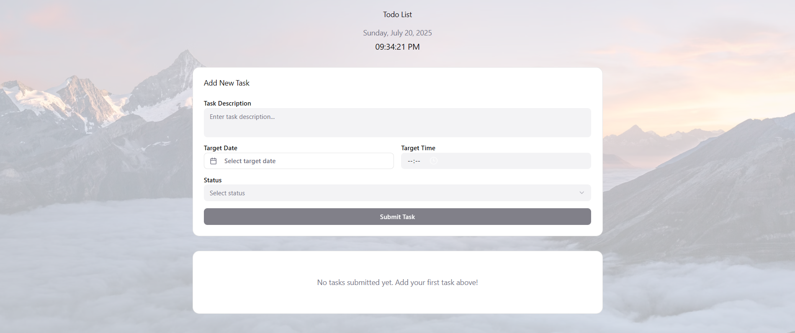

# ToDo List Web App

A simple responsive ToDo List web application built using HTML, CSS, and JavaScript.

## Features

- Add task descriptions with target date and time
- Select task status (Completed, Pending, etc.)
- Live display of current date and time
- Responsive layout with clean UI

## Technologies Used

- HTML5
- CSS3
- JavaScript

## Screenshots



## Getting Started

1. Clone the repository:
   ```bash
   git clone https://github.com/your-username/todo-list.git
   cd todo-list
